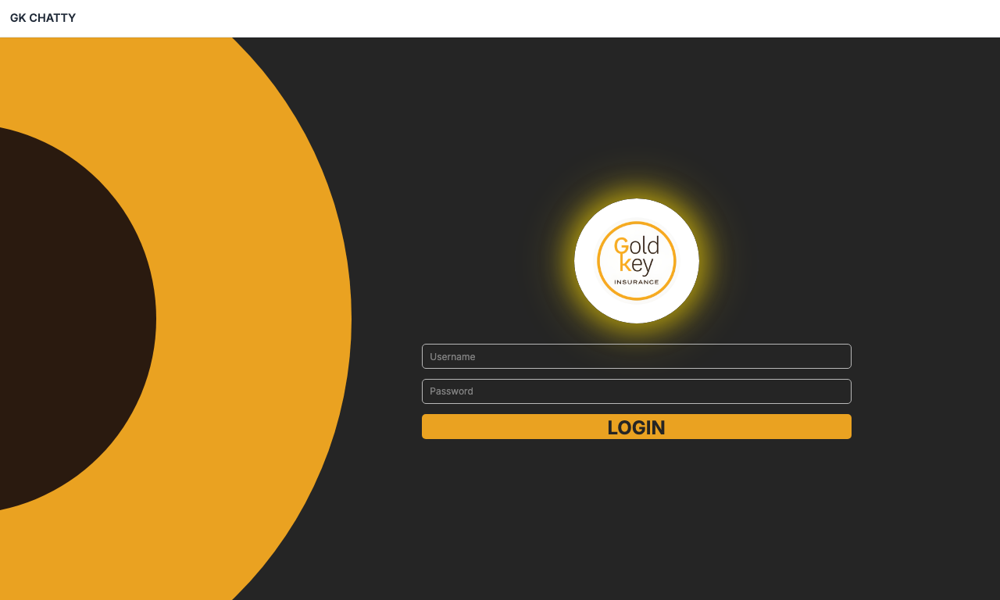

# GKChatty Staff Quick Reference

## Login

Enter your **username** and **password**, then click **LOGIN**.

---

## Main Interface

| Area | Purpose |
|------|---------|
| **Left Sidebar** | New Chat, Document Manager, Chat history, Logout |
| **Center** | Chat messages + input box |
| **Right Panel** | Notes, System KB, My Documents tabs |
| **Top Bar** | Hybrid/Knowledge Base/My Docs toggle, dark mode |

---

## Asking Questions
1. Type question in input box at bottom
2. Press **Enter** or click send button
3. Response includes: Answer + Source citations

**Tips**: Be specific | Include dates/names | Check sources

---

## Search Modes (Top toggles)
| Mode | Searches | Use For |
|------|----------|---------|
| **Knowledge Base** | Organization docs | Company-wide info |
| **My Docs** | Your uploads only | Personal references |
| **Hybrid** | Both sources | Comprehensive search |

---

## Key Features

| Feature | How To |
|---------|--------|
| **New Chat** | Click "New Chat" in sidebar |
| **Upload Docs** | Document Manager > Upload |
| **View History** | Click chat title in sidebar |
| **Add Notes** | Right panel > Notes tab |
| **Dark Mode** | Toggle sun/moon icon in top bar |

---

## Document Management
- **Upload**: Document Manager > Select PDF/TXT/MD
- **Organize**: Create folders, drag documents
- **Delete**: Click trash icon on document

---

## Troubleshooting
| Issue | Fix |
|-------|-----|
| No results | Check search mode, rephrase question |
| Slow response | Wait for progress indicator |
| Upload fails | Check file type (PDF/TXT/MD only) |

---
*v1.0 | Dec 2024 | Contact admin for support*
