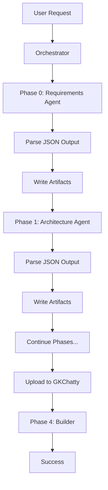

# BMAD Orchestrator - Production Implementation

**Version:** 2.0.0
**Date:** 2025-10-27
**Status:** Production Ready

## Overview

This document defines the production orchestration pattern for BMAD workflows. The orchestrator handles all I/O operations while agents provide pure computational functions.

## Orchestration Flow



## Agent Output Contract

All agents MUST return JSON in this format:

```json
{
  "status": "success|partial|failed",
  "phase": "requirements|architecture|discovery|planning|implementation|qa",
  "outputs": {
    // Phase-specific data
  },
  "artifacts": [
    {
      "name": "filename.ext",
      "path": "relative/path/to/file",
      "content": "actual file content",
      "type": "file|gkchatty",
      "metadata": {
        "description": "optional description",
        "format": "markdown|json|typescript|etc"
      }
    }
  ],
  "validation": {
    "checks": ["list", "of", "checks"],
    "passed": ["passed", "checks"],
    "failed": ["failed", "checks"],
    "warnings": ["optional", "warnings"]
  },
  "next_phase": {
    "ready": true,
    "blockers": [],
    "requirements": []
  },
  "errors": []
}
```

## Phase Specifications

### Phase 0: Requirements (Product Owner)

**Input:** User request string
**Agent:** Product Owner via general-purpose agent
**Output Contract:**
```json
{
  "outputs": {
    "user_stories": ["story1", "story2"],
    "acceptance_criteria": ["criteria1", "criteria2"],
    "scope": "MVP|Full|Enterprise",
    "constraints": ["time", "budget", "technical"]
  },
  "artifacts": [
    {
      "name": "requirements.md",
      "path": "specs/user-stories/YYYY-MM-DD-feature.md",
      "content": "# User Stories\n\n...",
      "type": "file"
    }
  ]
}
```

### Phase 1: Architecture (Architect)

**Input:** Requirements from Phase 0
**Agent:** Architect via general-purpose agent
**Output Contract:**
```json
{
  "outputs": {
    "components": ["frontend", "backend", "database"],
    "technologies": ["Next.js", "Supabase", "PostgreSQL"],
    "patterns": ["REST API", "WebSockets", "JWT Auth"],
    "decisions": [
      {
        "decision": "Use Supabase for backend",
        "rationale": "Provides auth, database, and realtime"
      }
    ]
  },
  "artifacts": [
    {
      "name": "architecture.md",
      "path": "specs/architecture/YYYY-MM-DD-feature.md",
      "content": "# System Architecture\n\n...",
      "type": "file"
    }
  ]
}
```

### Phase 2: Discovery (Scout)

**Input:** Requirements + Architecture
**Agent:** Scout via scout subagent
**Output Contract:**
```json
{
  "outputs": {
    "relevant_files": [
      {
        "path": "src/components/Auth.tsx",
        "relevance": "Authentication pattern reference",
        "priority": "high"
      }
    ],
    "gkchatty_context": [
      {
        "document": "previous-auth-implementation.md",
        "relevance": "Similar auth pattern"
      }
    ],
    "entry_points": ["src/index.ts", "src/app.tsx"],
    "dependencies": ["react", "supabase-js"]
  },
  "artifacts": [
    {
      "name": "discovery-report.json",
      "path": "specs/discovery/YYYY-MM-DD-feature.json",
      "content": "{...discovery data...}",
      "type": "file"
    }
  ]
}
```

### Phase 3: Planning (Planner)

**Input:** All previous phase outputs
**Agent:** Planner via planner subagent
**Output Contract:**
```json
{
  "outputs": {
    "total_steps": 25,
    "estimated_time": "4-6 hours",
    "complexity": "medium",
    "risk_level": "low"
  },
  "artifacts": [
    {
      "name": "implementation-plan.md",
      "path": "specs/plans/YYYY-MM-DD-feature.md",
      "content": "# Implementation Plan\n\n## Step 1: ...\n\n## Step 2: ...",
      "type": "gkchatty",
      "metadata": {
        "description": "Step-by-step implementation plan for feature",
        "tags": ["plan", "implementation", "feature-name"]
      }
    }
  ]
}
```

### Phase 4: Implementation (Builder Pro BMAD)

**Input:** Plan from GKChatty
**Execution:** Main session (has MCP access)
**Process:** RAG pattern - query each step individually

### Phase 5: QA Review

**Input:** Implemented code
**Agent:** QA via general-purpose agent
**Output Contract:**
```json
{
  "outputs": {
    "tests_passed": true,
    "code_quality": "A",
    "security_issues": [],
    "performance_concerns": [],
    "recommendations": []
  },
  "artifacts": [
    {
      "name": "qa-report.md",
      "path": "specs/qa/YYYY-MM-DD-feature.md",
      "content": "# QA Report\n\n...",
      "type": "file"
    }
  ]
}
```

## Orchestrator Implementation

The orchestrator (Claude Code main session) executes this workflow:

```python
for phase in phases:
    # 1. Prepare context
    context = prepare_phase_context(phase, previous_outputs)

    # 2. Invoke agent
    agent_output = invoke_agent(phase, context)

    # 3. Parse JSON output
    parsed = parse_json_with_fallback(agent_output)

    # 4. Validate structure
    validate_output_contract(phase, parsed)

    # 5. Process artifacts
    for artifact in parsed.artifacts:
        if artifact.type == 'file':
            write_file(artifact.path, artifact.content)
        elif artifact.type == 'gkchatty':
            upload_to_gkchatty(artifact)

    # 6. Check continuation
    if not parsed.next_phase.ready:
        handle_blocker(phase, parsed)
        break

    # 7. Store outputs
    outputs[phase] = parsed.outputs
```

## Error Handling

### Agent Failures
- If agent returns `status: "failed"`, stop workflow
- Log error details from `errors` array
- Prompt user for guidance

### JSON Parse Failures
- Attempt to extract JSON from text output
- If extraction fails, try to parse as structured text
- Last resort: treat as plain text and extract key information

### Artifact Processing Failures
- Log but don't stop workflow
- Mark artifact as "failed to process"
- Continue with remaining artifacts

### Validation Failures
- Warn about missing required fields
- Attempt to continue if non-critical
- Stop if critical fields missing

## MCP Operations

Only the orchestrator (main session) performs MCP operations:

```typescript
// Upload to GKChatty
async function uploadToGKChatty(artifact) {
  // 1. Switch to appropriate user
  await mcp__gkchatty_kb__switch_user({
    username: "builderpro-bmad",
    password: process.env.GKCHATTY_PASSWORD
  });

  // 2. Upload document
  await mcp__gkchatty_kb__upload_to_gkchatty({
    file_path: artifact.path,
    description: artifact.metadata.description
  });

  // 3. Verify upload
  const results = await mcp__gkchatty_kb__search_gkchatty({
    query: artifact.name
  });

  return results.length > 0;
}
```

## Agent Prompt Template

All agents should use this base template:

```markdown
You are a BMAD {phase} specialist agent.

CRITICAL INSTRUCTIONS:
1. You MUST return ONLY valid JSON
2. NO markdown code blocks
3. NO explanations outside JSON
4. Follow the exact schema provided

YOUR CAPABILITIES:
- Read and analyze provided inputs
- Process and transform data
- Generate outputs and recommendations

YOUR LIMITATIONS:
- CANNOT write files
- CANNOT use MCP tools
- CANNOT make network requests
- CANNOT access file system directly

INPUT CONTEXT:
{context}

REQUIRED OUTPUT SCHEMA:
{schema}

TASK:
{task_description}

Return ONLY the JSON object.
```

## Testing

### Unit Test Each Phase
```bash
# Test individual phase
bmad-test-phase requirements "Create login form"
bmad-test-phase architecture "{...requirements output...}"
```

### Integration Test
```bash
# Test full workflow
bmad-test-workflow "Create simple todo app"
```

### Validation Test
```bash
# Validate JSON output
echo '{...agent output...}' | bmad-validate-schema requirements
```

## Migration Guide

### Updating Existing Commands

1. **Old Pattern (Broken):**
```markdown
Planner: Create plan and save to specs/plans/feature.md
Then upload to GKChatty
```

2. **New Pattern (Working):**
```markdown
Planner: Return plan as JSON artifact with type="gkchatty"
Orchestrator will handle saving and uploading
```

### Backward Compatibility

The orchestrator includes compensation logic:
- Detects when agents attempt I/O operations
- Extracts intended operations from output
- Performs operations on behalf of agent
- Logs warnings for migration tracking

## Performance Metrics

Target performance for orchestration:
- JSON parsing: < 10ms
- File write: < 50ms per file
- GKChatty upload: < 1000ms
- Phase transition: < 100ms
- Total overhead: < 2% of workflow time

## Monitoring

Track these metrics:
- Phase success rate
- Agent JSON compliance
- Artifact processing success
- Error frequency by type
- Workflow completion rate

## Best Practices

1. **Keep agent outputs focused** - Only include necessary data
2. **Use metadata effectively** - Help orchestrator make decisions
3. **Validate early** - Check outputs before processing artifacts
4. **Log everything** - Debugging distributed systems requires logs
5. **Test incrementally** - Verify each phase before integration

## Version History

- **v2.0.0** (2025-10-27): Complete rewrite with orchestration pattern
- **v1.0.0** (2025-10-22): Original autonomous agent pattern (deprecated)

---

This orchestration pattern ensures reliable, observable, and maintainable BMAD workflows.