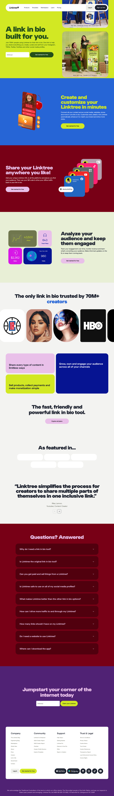
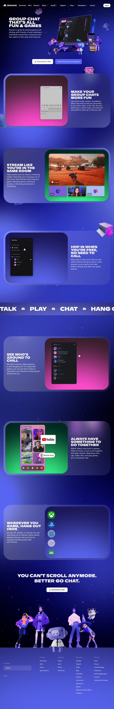
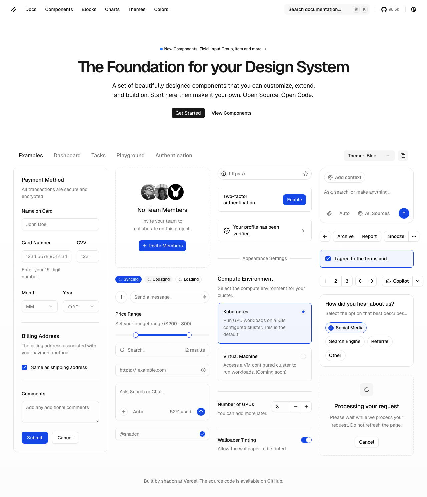

# CommiSocial - Product Brief

**Date:** October 27, 2025
**Version:** 1.0
**Status:** Ready for Implementation
**Project Type:** Social Aggregation Platform

## Executive Summary

CommiSocial is a creator-focused social aggregation platform that combines Reddit's community structure with Linktree's link aggregation utility. It serves as a hub for creators to share their work (hosted elsewhere), foster discussion, and build a dedicated following.

## Visual Research & Design Analysis

### Linktree Analysis


**Key Design Patterns:**
- **Hero Section:** Bold gradient background (#84CC16 to #3B82F6), large sans-serif typography
- **Color Palette:** Vibrant, playful with high contrast
  - Primary Green: #84CC16
  - Blue Accent: #3B82F6
  - Dark sections: #1E293B
  - Purple accent: #8B5CF6
- **Typography:** Clean, modern sans-serif (appears to be Inter or similar)
  - Hero text: 48-64px bold
  - Body text: 16px regular
- **Card Design:** Rounded corners (12-16px), subtle shadows
- **Spacing:** Generous whitespace, 32-48px section padding
- **Visual Style:** Playful 3D illustrations, gradient overlays

**Link Aggregation Features:**
- Visual link preview cards
- Customizable themes
- Analytics dashboard
- QR code generation
- Social media integration

### Discord Analysis


**Key Design Patterns:**
- **Dark Theme First:** Deep purple/blue gradient background (#5865F2 to #2C2F33)
- **Color Palette:**
  - Discord Blue: #5865F2
  - Dark Background: #2C2F33
  - Text: White with various opacities
  - Accent Pink: #EB459E
- **Typography:** Custom Discord font (Ginto/Whitney)
  - Headers: Bold, all-caps for emphasis
  - Clean readability on dark backgrounds
- **Visual Elements:**
  - Floating UI mockups with glass morphism
  - Character illustrations for personality
  - Smooth gradient transitions
- **Community Features:**
  - Voice/video integration prominently displayed
  - Server/channel hierarchy visible
  - User presence indicators

### shadcn/ui Component Analysis


**Component Patterns:**
- **Cards:** Clean white backgrounds, subtle borders (#E5E7EB), rounded-lg (8px)
- **Forms:**
  - Input fields with clear borders
  - Labels above inputs
  - Error states with red accents
- **Buttons:**
  - Primary: Black background, white text
  - Secondary: White background with border
  - Ghost: Transparent with hover states
- **Theme Toggle:** Light/dark mode switcher in header
- **Typography:** System font stack, clean hierarchy
- **Spacing:** Consistent 4px grid system (p-4, gap-4, etc.)

## Design Direction for CommiSocial

### Visual Identity

**Color Palette (Inspired by Analysis):**
```css
--primary: #5865F2;        /* Discord-inspired blue for community */
--secondary: #84CC16;      /* Linktree-inspired green for links */
--background: #FFFFFF;     /* Clean white background */
--surface: #F8F9FA;        /* Light gray for cards */
--text-primary: #1A1A1A;  /* Near black for text */
--text-secondary: #6B7280; /* Gray for secondary text */
--border: #E5E7EB;        /* Subtle borders */
--accent-upvote: #FF4500; /* Reddit orange for upvotes */
--accent-downvote: #7193FF; /* Blue for downvotes */
```

**Dark Mode:**
```css
--background-dark: #0F0F0F;
--surface-dark: #1A1A1A;
--border-dark: #2A2A2A;
```

**Typography:**
- Font Family: Inter (primary), system-ui (fallback)
- Heading 1: 32px, font-bold
- Heading 2: 24px, font-semibold
- Body: 16px, font-normal
- Small: 14px, font-normal
- Caption: 12px, font-medium

**Spacing System:**
- Base unit: 4px
- Component padding: 16px (p-4)
- Section spacing: 32px (gap-8)
- Card gap: 16px (gap-4)

## Core Features (MVP)

### 1. User Authentication
**Implementation:**
- Supabase Auth with email/password
- JWT tokens with refresh capability
- Protected routes using Next.js middleware

**UI Components:**
- Sign up form (email, password, username)
- Login form with "Remember me" option
- Password reset flow
- Email verification

### 2. Creator Profiles
**Structure:**
```typescript
interface CreatorProfile {
  id: string;
  username: string;
  displayName: string;
  bio: string;
  avatar: string;
  links: ExternalLink[];
  joinedDate: Date;
  karma: number;
}

interface ExternalLink {
  id: string;
  title: string;
  url: string;
  icon: string; // auto-detected or custom
  clicks: number;
}
```

**Visual Design:**
- Hero section with avatar and bio
- Link grid similar to Linktree (vertical list)
- Posts feed below profile info
- Follow/unfollow button

### 3. Hubs (Communities)
**Initial Hubs:**
- `/h/music` - Music creators
- `/h/visualarts` - Visual artists
- `/h/writing` - Writers and authors

**Hub Page Layout:**
- Header with hub name and description
- Subscribe/unsubscribe button with member count
- Sort options (Hot, New, Top)
- Post feed with infinite scroll
- Sidebar with hub rules and info

### 4. Post System
**Post Types:**

**Link Post:**
- Title (required, max 300 chars)
- URL (required, validated)
- Auto-generate preview with Open Graph data
- Smart embeds for YouTube, Spotify, SoundCloud

**Text Post:**
- Title (required, max 300 chars)
- Body (Markdown support, max 10,000 chars)
- Rich text editor with preview

**Post Card Design:**
```jsx
<Card className="p-4 hover:shadow-md transition-shadow">
  <div className="flex gap-4">
    <VoteButtons votes={post.votes} />
    <div className="flex-1">
      <PostMeta hub={post.hub} author={post.author} time={post.createdAt} />
      <h3 className="text-lg font-semibold">{post.title}</h3>
      {post.type === 'link' && <LinkPreview url={post.url} />}
      {post.type === 'text' && <TextPreview content={post.content} />}
      <PostActions comments={post.commentCount} />
    </div>
  </div>
</Card>
```

### 5. Voting System
**Implementation:**
- Upvote/downvote with instant feedback
- Prevent double voting
- Real-time vote count updates via Supabase subscriptions
- Karma calculation for users

**UI Design:**
- Vertical vote buttons (Reddit style)
- Color change on vote (#FF4500 for upvote, #7193FF for downvote)
- Animated number transitions

### 6. Comment System
**Features:**
- Threaded/nested comments (infinite depth)
- Markdown support
- Edit/delete own comments
- Sort by: Best, Top, New, Controversial

**Comment Component:**
```jsx
<div className="border-l-2 border-gray-200 pl-4">
  <CommentHeader author={comment.author} time={comment.createdAt} />
  <CommentBody content={comment.content} />
  <CommentActions onReply={handleReply} votes={comment.votes} />
  {comment.replies && <CommentThread comments={comment.replies} />}
</div>
```

### 7. Main Feed
**Algorithm:**
- Default: "Hot" (combination of votes and recency)
- Options: New, Top (day/week/month/all)
- Personalized based on subscribed hubs

**Feed Layout:**
- Infinite scroll with intersection observer
- Loading skeletons during fetch
- Empty state with hub suggestions

## Smart Embeds Implementation

### YouTube Integration
```typescript
function YouTubeEmbed({ url }: { url: string }) {
  const videoId = extractYouTubeId(url);
  return (
    <iframe
      className="w-full aspect-video rounded-lg"
      src={`https://www.youtube.com/embed/${videoId}`}
      allowFullScreen
    />
  );
}
```

### Spotify Integration
```typescript
function SpotifyEmbed({ url }: { url: string }) {
  const embedUrl = url.replace('open.spotify.com', 'open.spotify.com/embed');
  return (
    <iframe
      className="w-full h-152 rounded-lg"
      src={embedUrl}
      allowTransparency
    />
  );
}
```

### SoundCloud Integration
Similar pattern using SoundCloud's oEmbed API

## Database Schema (Supabase)

```sql
-- Users (extends Supabase auth.users)
CREATE TABLE profiles (
  id UUID PRIMARY KEY REFERENCES auth.users(id),
  username VARCHAR(30) UNIQUE NOT NULL,
  display_name VARCHAR(100),
  bio TEXT,
  avatar_url TEXT,
  karma INTEGER DEFAULT 0,
  created_at TIMESTAMPTZ DEFAULT NOW()
);

-- Hubs (Communities)
CREATE TABLE hubs (
  id UUID PRIMARY KEY DEFAULT gen_random_uuid(),
  name VARCHAR(50) UNIQUE NOT NULL, -- e.g., 'music'
  display_name VARCHAR(100) NOT NULL,
  description TEXT,
  icon_url TEXT,
  created_at TIMESTAMPTZ DEFAULT NOW(),
  creator_id UUID REFERENCES profiles(id)
);

-- Hub Subscriptions
CREATE TABLE subscriptions (
  user_id UUID REFERENCES profiles(id),
  hub_id UUID REFERENCES hubs(id),
  subscribed_at TIMESTAMPTZ DEFAULT NOW(),
  PRIMARY KEY (user_id, hub_id)
);

-- Posts
CREATE TABLE posts (
  id UUID PRIMARY KEY DEFAULT gen_random_uuid(),
  title VARCHAR(300) NOT NULL,
  type VARCHAR(10) CHECK (type IN ('link', 'text')),
  content_url TEXT, -- for link posts
  text_content TEXT, -- for text posts
  hub_id UUID REFERENCES hubs(id),
  author_id UUID REFERENCES profiles(id),
  score INTEGER DEFAULT 0,
  created_at TIMESTAMPTZ DEFAULT NOW(),
  updated_at TIMESTAMPTZ DEFAULT NOW()
);

-- Comments
CREATE TABLE comments (
  id UUID PRIMARY KEY DEFAULT gen_random_uuid(),
  content TEXT NOT NULL,
  post_id UUID REFERENCES posts(id) ON DELETE CASCADE,
  author_id UUID REFERENCES profiles(id),
  parent_id UUID REFERENCES comments(id), -- for threading
  score INTEGER DEFAULT 0,
  created_at TIMESTAMPTZ DEFAULT NOW(),
  updated_at TIMESTAMPTZ DEFAULT NOW()
);

-- Votes
CREATE TABLE votes (
  user_id UUID REFERENCES profiles(id),
  target_id UUID NOT NULL, -- can be post_id or comment_id
  target_type VARCHAR(10) CHECK (target_type IN ('post', 'comment')),
  vote_type INTEGER CHECK (vote_type IN (1, -1)), -- 1 = upvote, -1 = downvote
  created_at TIMESTAMPTZ DEFAULT NOW(),
  PRIMARY KEY (user_id, target_id, target_type)
);

-- External Links (for profiles)
CREATE TABLE external_links (
  id UUID PRIMARY KEY DEFAULT gen_random_uuid(),
  profile_id UUID REFERENCES profiles(id) ON DELETE CASCADE,
  title VARCHAR(100) NOT NULL,
  url TEXT NOT NULL,
  icon_url TEXT,
  position INTEGER DEFAULT 0,
  clicks INTEGER DEFAULT 0,
  created_at TIMESTAMPTZ DEFAULT NOW()
);
```

## Row Level Security (RLS) Policies

```sql
-- Profiles: Public read, owner write
ALTER TABLE profiles ENABLE ROW LEVEL SECURITY;

CREATE POLICY "Profiles are viewable by everyone"
  ON profiles FOR SELECT
  USING (true);

CREATE POLICY "Users can update own profile"
  ON profiles FOR UPDATE
  USING (auth.uid() = id);

-- Posts: Public read, authenticated create, owner update/delete
ALTER TABLE posts ENABLE ROW LEVEL SECURITY;

CREATE POLICY "Posts are viewable by everyone"
  ON posts FOR SELECT
  USING (true);

CREATE POLICY "Authenticated users can create posts"
  ON posts FOR INSERT
  WITH CHECK (auth.uid() IS NOT NULL);

CREATE POLICY "Users can update own posts"
  ON posts FOR UPDATE
  USING (auth.uid() = author_id);

-- Similar policies for comments, votes, etc.
```

## Technical Architecture

### Tech Stack
- **Frontend:** Next.js 14 with App Router
- **UI Components:** shadcn/ui with Tailwind CSS
- **Backend:** Supabase (PostgreSQL + Auth + Realtime)
- **Deployment:** Vercel
- **State Management:** Zustand for client state
- **Data Fetching:** TanStack Query with Supabase client

### Project Structure
```
commisocial/
├── app/
│   ├── (auth)/
│   │   ├── login/
│   │   └── signup/
│   ├── h/
│   │   └── [hubName]/
│   │       ├── page.tsx        # Hub feed
│   │       └── [postId]/
│   │           └── page.tsx    # Post detail
│   ├── u/
│   │   └── [username]/
│   │       └── page.tsx       # User profile
│   ├── submit/
│   │   └── page.tsx           # Create post
│   └── page.tsx               # Main feed
├── components/
│   ├── ui/                   # shadcn/ui components
│   ├── posts/
│   │   ├── PostCard.tsx
│   │   ├── PostForm.tsx
│   │   └── VoteButtons.tsx
│   ├── comments/
│   │   ├── CommentThread.tsx
│   │   └── CommentForm.tsx
│   └── layout/
│       ├── Header.tsx
│       └── Sidebar.tsx
├── lib/
│   ├── supabase/
│   │   ├── client.ts
│   │   └── server.ts
│   └── utils.ts
└── hooks/
    ├── useAuth.ts
    ├── usePosts.ts
    └── useComments.ts
```

## Implementation Phases

### Phase 1: Foundation (Days 1-2)
1. Set up Next.js with TypeScript
2. Configure Supabase project
3. Implement authentication flows
4. Create database schema with RLS
5. Set up shadcn/ui components

### Phase 2: Core Features (Days 3-4)
1. Build hub system and pages
2. Implement post creation (link + text)
3. Add voting system with real-time updates
4. Create main feed with sorting

### Phase 3: Social Features (Days 5-6)
1. Build comment system with threading
2. Create user profiles with link management
3. Add smart embeds for media
4. Implement hub subscriptions

### Phase 4: Polish & Deploy (Day 7)
1. Add loading states and error handling
2. Implement infinite scroll
3. Dark mode support
4. Deploy to Vercel
5. Set up analytics

## Success Metrics

**MVP Launch Targets:**
- Page load time < 2 seconds
- Time to first post < 30 seconds
- Mobile responsive (100% viewport coverage)
- Zero critical accessibility issues
- 95% uptime on Vercel free tier

**User Engagement Goals:**
- 100 early adopters in first week
- 50% return rate after first visit
- Average session > 5 minutes
- 10+ posts per day
- 30+ comments per day

## Component Examples

### Post Card (shadcn/ui style)
```tsx
import { Card, CardContent } from '@/components/ui/card';
import { Button } from '@/components/ui/button';
import { ArrowUp, ArrowDown, MessageSquare, Share2 } from 'lucide-react';

export function PostCard({ post }: { post: Post }) {
  return (
    <Card className="hover:shadow-md transition-all duration-200">
      <CardContent className="p-4">
        <div className="flex gap-4">
          {/* Vote Section */}
          <div className="flex flex-col items-center gap-1">
            <Button
              variant="ghost"
              size="sm"
              className="h-8 w-8 p-0 hover:text-orange-500"
            >
              <ArrowUp className="h-4 w-4" />
            </Button>
            <span className="text-sm font-medium">{post.score}</span>
            <Button
              variant="ghost"
              size="sm"
              className="h-8 w-8 p-0 hover:text-blue-500"
            >
              <ArrowDown className="h-4 w-4" />
            </Button>
          </div>

          {/* Content Section */}
          <div className="flex-1 space-y-2">
            {/* Meta */}
            <div className="flex items-center gap-2 text-xs text-gray-500">
              <a href={`/h/${post.hub.name}`} className="font-medium hover:underline">
                h/{post.hub.name}
              </a>
              <span>•</span>
              <a href={`/u/${post.author.username}`} className="hover:underline">
                u/{post.author.username}
              </a>
              <span>•</span>
              <time>{formatTime(post.createdAt)}</time>
            </div>

            {/* Title */}
            <h3 className="text-lg font-semibold hover:text-blue-600">
              <a href={`/h/${post.hub.name}/${post.id}`}>
                {post.title}
              </a>
            </h3>

            {/* Preview */}
            {post.type === 'link' && (
              <LinkPreview url={post.contentUrl} />
            )}
            {post.type === 'text' && (
              <p className="text-gray-600 line-clamp-3">
                {post.textContent}
              </p>
            )}

            {/* Actions */}
            <div className="flex items-center gap-4 pt-2">
              <Button variant="ghost" size="sm" className="h-8 gap-2">
                <MessageSquare className="h-4 w-4" />
                <span>{post.commentCount} Comments</span>
              </Button>
              <Button variant="ghost" size="sm" className="h-8 gap-2">
                <Share2 className="h-4 w-4" />
                <span>Share</span>
              </Button>
            </div>
          </div>
        </div>
      </CardContent>
    </Card>
  );
}
```

### Creator Profile Links Section
```tsx
import { Card } from '@/components/ui/card';
import { ExternalLink } from 'lucide-react';

export function CreatorLinks({ links }: { links: ExternalLink[] }) {
  return (
    <div className="space-y-3">
      {links.map((link) => (
        <Card
          key={link.id}
          className="p-4 hover:shadow-lg transition-all cursor-pointer"
          onClick={() => window.open(link.url, '_blank')}
        >
          <div className="flex items-center gap-3">
            <div className="h-10 w-10 rounded-full bg-gradient-to-br from-blue-500 to-purple-600 flex items-center justify-center">
              <ExternalLink className="h-5 w-5 text-white" />
            </div>
            <div className="flex-1">
              <h4 className="font-medium">{link.title}</h4>
              <p className="text-sm text-gray-500">{getDomain(link.url)}</p>
            </div>
            <div className="text-gray-400">
              →
            </div>
          </div>
        </Card>
      ))}
    </div>
  );
}
```

## Pre-Launch Checklist

- [ ] Supabase project created with auth configured
- [ ] Database schema deployed with RLS policies
- [ ] Next.js app initialized with TypeScript
- [ ] shadcn/ui components installed
- [ ] Authentication flows working (signup, login, logout)
- [ ] Hub pages rendering with posts
- [ ] Post creation for both link and text types
- [ ] Voting system with real-time updates
- [ ] Comment system with threading
- [ ] User profiles with external links
- [ ] Smart embeds for YouTube, Spotify, SoundCloud
- [ ] Mobile responsive design verified
- [ ] Dark mode toggle working
- [ ] Vercel deployment configured
- [ ] Custom domain set up (if available)
- [ ] Analytics tracking installed
- [ ] Error monitoring (Sentry) configured
- [ ] Landing page for waitlist capture
- [ ] Initial seed data for testing

## Risk Mitigation

**Potential Issues & Solutions:**

1. **Reddit blocks screenshot access**
   - Solution: Use knowledge of Reddit's UI patterns
   - Fallback: Reference old.reddit.com or mobile apps

2. **Supabase rate limits on free tier**
   - Solution: Implement caching with TanStack Query
   - Monitor usage and upgrade if needed

3. **Complex threading performance**
   - Solution: Limit thread depth initially
   - Use pagination for deep threads

4. **Spam and moderation**
   - Solution: Start with invite-only
   - Add rate limiting on posts/comments
   - Plan for moderation tools in Phase 2

## Conclusion

CommiSocial combines the best of Reddit's community engagement with Linktree's creator-focused link aggregation. The MVP scope is achievable within a week using modern tools like Next.js, Supabase, and shadcn/ui. The visual design draws inspiration from successful platforms while maintaining its own identity through the unique combination of features.

**Next Steps:**
1. Initialize the technical stack
2. Begin Phase 1 implementation
3. Set up landing page for user acquisition
4. Start reaching out to potential early adopters

---

*Prepared for Builder Pro Implementation*
*Visual references and specifications included*
*Ready for /bmad-pro-build execution*